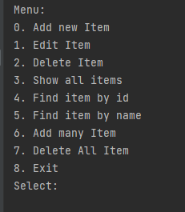

# Проект - Tracker

## О проекте  

Учебный проект - Консольное приложение "Tracker", система для работы с заявками.
Позволяет добавлять, редактировать, удалять, искать и сортировать заявки.
Имеет несколько вариантов хранения данных: в памяти и в базах данных.
Цель проекта: демонстрация основных принципов ООП (особенности архитектуры, 
взаимодействие объектов, модели данных, хранилища и т.д.)

#### Технологии
>JDK14, Maven, PostgreSQL, Hibernate, Liquibase, Java SE, JDBC, Mockito, JUnit4

## Сборка

Для сборки проекта необходимо:
- Установить JDK 14, Maven.
- Установить PostgreSQL, задать логин - postgres, пароль - password.
- Скачать исходный код проекта с GitHub.
- Перейти в папку, где лежит файл pom.xml.
- Создайте базу данных в соответствии с настройками, указанными в файле *src/main/resources/app.properties*. 
- Осуществите сборку приложения: `mvn clean install`
- Запустите из консоли командой: `java -jar target/tracker.jar`

## Использование
Работа приложения начинается с главного меню. Для навигации по меню используются цифры

## Контакты

